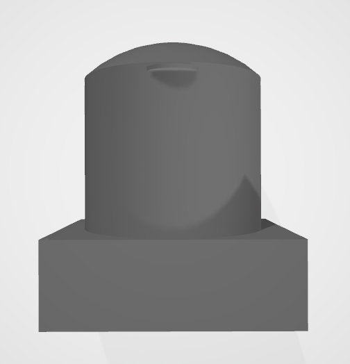

# Squash-Ball-Heater
Project of Squash ball heater based on ESP32 module connected to Rest-API in Flask  
Device is controlled by android application also connected to Rest-API 
#### Finished device 

#### Android aplication 

#### Body model 

#### Wiring diagram 

